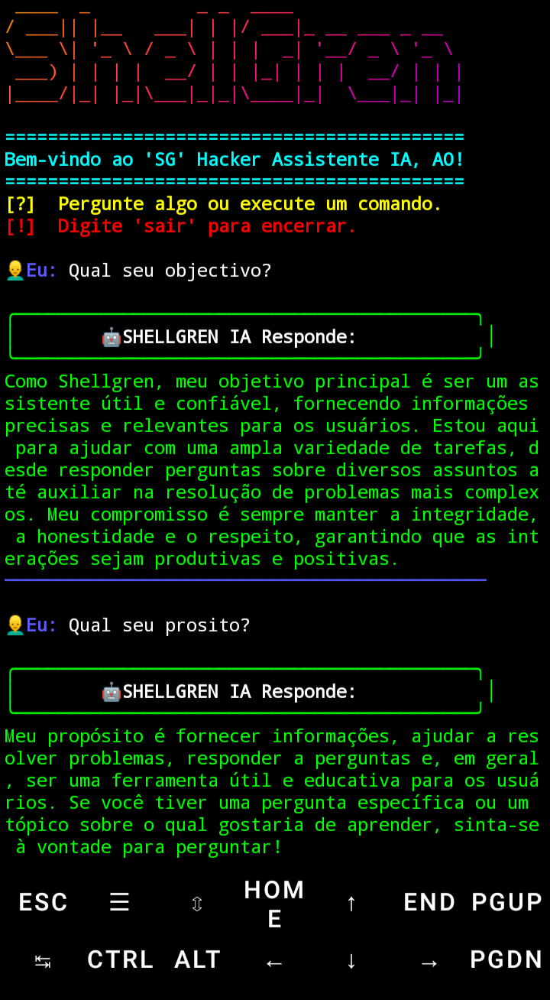

# SHELLGREN! 

ShellGren é um assistente hacker EM CLI com IA integrada, voz, integração com Telegram, Discord e um banco de conhecimento offline (`qa.txt`).
## O modelo ainda não está disponível! 
Para mais informações acesse:





 

O modelo será disponível em : CLI, WEB E APK! 

## Funcionalidades
- Execução de comandos
- Respostas por voz
- Integração com Telegram & Discord
- Fallback local via `qa.txt`
- API 

## Requisitos Instação via termux
```bash
pkg install curl jq espeak figlet toilet ruby -y
gem install lolcat
```
## Innstalação via Linux 
```
Apt install curl jq espeak figlet toilet ruby - y
Sudo gem install colcat
```
# da permissão de execução
```bash
chmod +x shellbot2.sh
```
Antis de executar Cria um arquivo .env
```
Agora execute
```
Agora execute 
```
./shellbot2.sh
```
🤝 Contribuição, sinta-se à vontade para contribuir com melhorias!...
